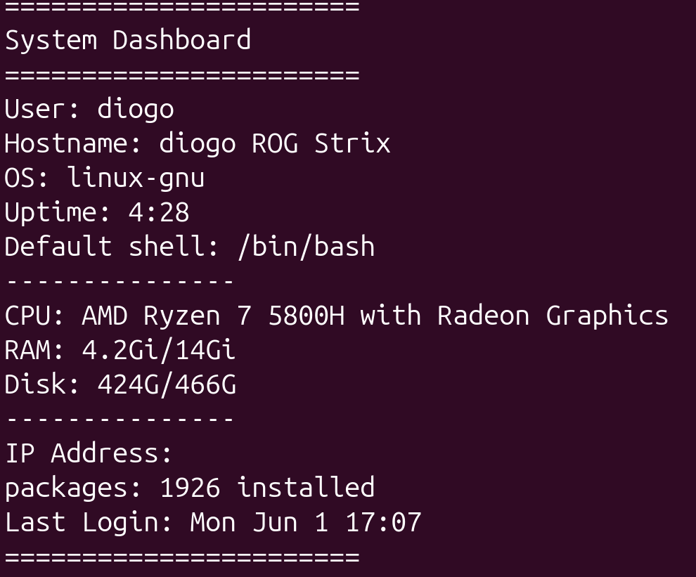

# file Breakdown

NOTE THAT THIS IS HIGHLY INFORMAL 

ALL of these scripts are being created using the terminal more specifically the text editor VIM 

## SETUP SH
This script is just a quick data engineering dev folder set up script, basically waht it does is it generates all of
the essentialy directories that i use for my data engineer projects as well as prompt for a few specfic ones.
The outcome is that i dont need to keep wasting 5 minutes to set up a (venv,env,data,schema etc) folders manually.

## Tasks SH
This was just a pratice script because i had never used bash array's before and i also wanted to dust off my loops,
so my solution was to just create a simple tasks list scrip where you can essentially add,remove or list tasks.

## sys Dashboard SH
This is actually a cool script however it is irrelavant because there are also many many comands and ways to get 
the system information this script provides ,but none the less  think its cool. The main purpose of this script was 
for me to dust off some of the more common and usefull text manipulation tools bash offers so i ended up creating
a script that lists a bunch of system and session information :

It lacks some editing i think to make it more PRETTY , as well as some colour or highlight features and i might still do that at some point just because why not but for now i wont simply becuase i only made this script to pratice the aforementioned things.

